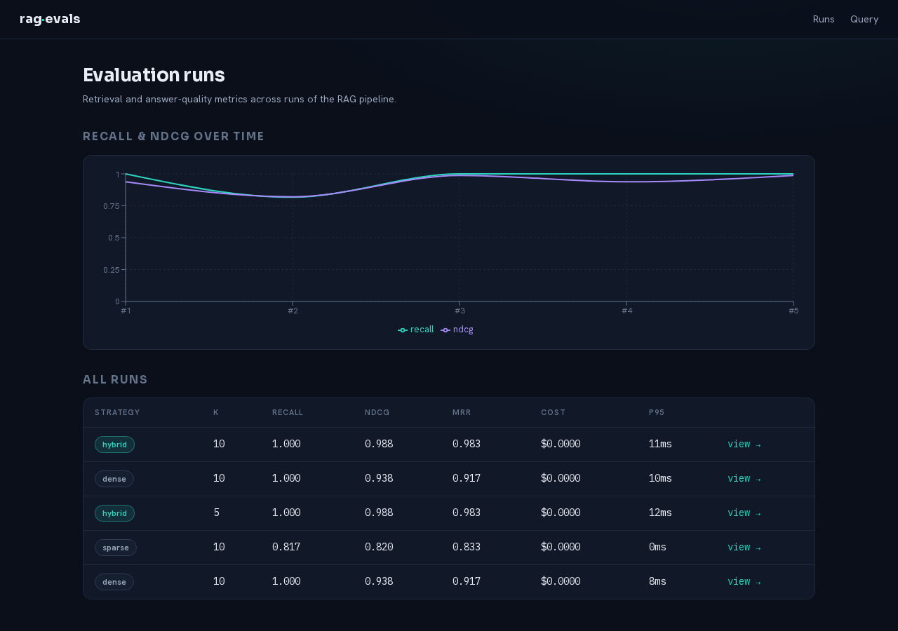

# rag-evals

**A RAG service with a rigorous evaluation harness — retrieval metrics, LLM-as-judge answer quality, cost & latency, and a regression gate in CI.**

[](https://github.com/augustoamaro/rag-evals/actions/workflows/ci.yml)
&nbsp;
&nbsp;
&nbsp;

Most RAG demos answer a question and stop. This one **measures** itself. It ingests
documents, retrieves with **hybrid search** (dense vectors + keyword, fused with
RRF), and answers with **citations** — then a two-track eval harness scores
retrieval quality (recall@k, MRR, nDCG) against a labeled golden set and answer
quality (faithfulness, relevance, citation-correctness) with an LLM judge, tracks
cost and latency, and **fails CI if retrieval regresses**.

The core runs from a fresh clone with **no API key**: embeddings are local
(fastembed/ONNX), so ingestion, retrieval, and retrieval-metric evals all work
offline and in CI. Claude (Opus 4.8) powers the parts that need a frontier LLM —
answer generation and the judge — gated behind `RAG_ANTHROPIC_API_KEY` and
degrading gracefully without it.



---

## What it measures

On the bundled corpus + 30-case golden set, the harness shows hybrid retrieval
beating either arm alone — exactly the kind of result it exists to surface:

| Strategy | Recall@10 | nDCG@10 | MRR |
|----------|:---------:|:-------:|:---:|
| dense    | 1.000 | 0.938 | 0.917 |
| sparse   | 0.817 | 0.820 | 0.833 |
| **hybrid** | **1.000** | **0.988** | **0.983** |

## Architecture

Clean architecture: dependencies point inward toward a pure domain. The LLM
(Anthropic SDK), the database (pgvector/SQL), and the embedding model each live
behind a port and appear in exactly one adapter.

```
rag-evals/
├── src/rag/
│   ├── domain/        PURE — entities + Protocol ports (Embedder, Retriever,
│   │                  Generator, Judge, ChunkStore). No I/O, no framework.
│   ├── metrics/       PURE — recall/precision/MRR/nDCG, RRF fusion, snippet
│   │                  relevance, percentiles. Hand-verified test vectors.
│   ├── chunking/      PURE — deterministic word-windowed chunking.
│   ├── adapters/      INFRA — the only modules with I/O / SDK / SQL:
│   │     embedding/   fastembed (bge-small, 384-dim, local, no key)
│   │     retrieval/   pgvector hybrid (dense HNSW + FTS + RRF + rerank)
│   │     db/          psycopg3, migrations, chunk store, eval store
│   │     llm/         Claude generator + judge (the only Anthropic SDK *usage*;
│   │                  composition roots construct the client and inject it)
│   ├── services/      ingestion · query · eval (orchestrate ports)
│   ├── api/           FastAPI (thin routers, dependency-injected)
│   └── cli/           Typer: rag ingest · rag eval [--judge] [--gate]
├── corpus/            bundled docs + golden.yaml (version-controlled)
├── migrations/        ordered .sql
└── apps/web/          Next.js dashboard
```

Decisions worth calling out:

- **Local embeddings + Claude, key-gated.** The whole retrieval pipeline and its
  metrics run with zero secrets, in CI, from a fresh clone. Claude is used only
  where a frontier LLM earns its place — answers and judging.
- **Hybrid = pgvector dense + Postgres FTS sparse + RRF.** Real hybrid retrieval
  with **no extra infrastructure** (one Postgres). RRF fuses by rank, so it needs
  no score calibration across the two very different score scales.
- **Passage-anchored ground truth.** A golden case marks relevant *passages*
  (snippets), and a chunk counts as relevant if it contains one. Retrieval metrics
  stay stable across chunker changes — a test asserts every case still anchors to a
  real chunk after ingestion.
- **The eval harness is the spine, retrieval-first.** Retrieval metrics need no
  LLM, so the headline quality signal is reproducible and CI-gateable for free; the
  LLM-judge answer track layers on top.
- **psycopg3 + explicit SQL over an ORM.** The hybrid-retrieval SQL (pgvector +
  FTS + RRF) is the interesting part — it stays visible.

## Eval methodology

- **Retrieval track (no LLM):** for each golden case, retrieve with a strategy
  (`dense` / `sparse` / `hybrid` / `hybrid_rerank`) and compute **recall@k**,
  **precision@k**, **MRR**, and **nDCG@k**. Relevance is snippet-containment, so
  metrics are deterministic and reproducible. One known bias: a snippet that
  falls inside the chunker's overlap window matches two chunks, so the same
  passage counts twice in the recall denominator — metrics *understate* rather
  than inflate (3 of 30 cases today).
- **Answer track (Claude judge):** generate an answer from the retrieved context
  with inline citations, then score **faithfulness**, **relevance**, and
  **citation-correctness** in [0, 1] via Claude structured output.
- **Cost & latency:** token usage → USD (Opus 4.8 pricing); per-case latency
  aggregated to p50/p95 per run.
- **Regression gate:** `rag eval --gate` exits non-zero if aggregate retrieval
  metrics drop below thresholds. CI gates **each strategy separately at k=3** —
  on a small corpus, recall@10 saturates for every strategy, so a single hybrid
  gate would pass even with one retrieval arm fully broken; per-arm gates at a
  k where the strategies separate catch exactly that. Runs with **no key**.

## Tech stack

| Area | Choice |
|------|--------|
| Language | Python 3.12 (uv), **mypy strict**; TypeScript strict (web) |
| Retrieval | Postgres + **pgvector** (dense, HNSW) · Postgres FTS (sparse) · RRF |
| Embeddings | **fastembed** (bge-small-en-v1.5, ONNX, local) |
| LLM | **Claude Opus 4.8** via the `anthropic` SDK (generation + judge) |
| API / CLI | FastAPI · Typer |
| Frontend | Next.js (App Router) · Recharts |
| Tests | pytest (unit + integration on real Postgres) · Vitest |
| Tooling | uv · ruff · mypy · Docker Compose · GitHub Actions |

## Run it

### Docker (one command)

```bash
docker compose up --build
# → dashboard: http://localhost:3000
# → API:       http://localhost:8000  (health: /healthz, docs: /docs)
```

The API container applies migrations and ingests the bundled corpus on startup.
To enable answer generation and the judge track, export a key first:

```bash
RAG_ANTHROPIC_API_KEY=sk-ant-... docker compose up --build
```

### Local development

```bash
uv sync                                  # Python 3.12 toolchain + deps
docker run -d -p 5432:5432 \
  -e POSTGRES_USER=rag -e POSTGRES_PASSWORD=rag -e POSTGRES_DB=rag \
  pgvector/pgvector:pg16

uv run rag ingest                        # migrate + embed + index the corpus
uv run rag eval --strategy hybrid --k 10 # retrieval eval (no key)
uv run rag eval --judge                  # + answer track (needs RAG_ANTHROPIC_API_KEY)
uv run uvicorn rag.api.app:build_app --factory --port 8000

cd apps/web && pnpm install && pnpm dev   # dashboard at http://localhost:3000
```

Configuration is via `RAG_`-prefixed env vars — see [`.env.example`](.env.example).

## Tests

```bash
uv run ruff check src tests       # lint
uv run mypy src                   # strict types
uv run pytest                     # unit (pure metrics, services, adapters via fakes)
uv run pytest -m integration      # real Postgres + pgvector — set RAG_TEST_DATABASE_URL
                                  # to a DISPOSABLE database (the suite truncates it)
cd apps/web && pnpm test          # dashboard component tests
```

What the tests prove:

- **Metrics & fusion** — recall/precision/MRR/nDCG and RRF against hand-computed
  vectors; the golden set is asserted to anchor to real chunks.
- **Retrieval** — dense returns the semantically-closest chunk, sparse matches
  keywords only, hybrid fuses both, rerank reorders — against real Postgres.
- **LLM adapters** — the generator parses citations and the judge maps structured
  scores, both via a fake Anthropic client (no key in CI); opt-in `live`-marked
  tests hit the real API (`RAG_ANTHROPIC_API_KEY=... uv run pytest -m live`).
- **End-to-end** — ingest → hybrid eval → persist → the API serves the results,
  through the real stack (integration-marked); the regression gate runs on every
  push.

## Limitations & follow-ups

Deliberate scope decisions, documented as judgment rather than oversight:

- **Sparse arm uses `plainto_tsquery`,** which ANDs every term — question-shaped
  queries can match nothing, part of why sparse recall trails. OR-semantics (or
  query rewriting) is the obvious next experiment *for the harness to measure*.
- **The bundled corpus is small** (10 docs / 20 chunks), chosen so evals are
  reproducible from a fresh clone in seconds. Recall saturates at large k —
  which is why CI gates per strategy at k=3. A larger corpus profile would make
  the strategy comparison stronger.
- **Playground scores are ranks,** not raw similarities: RRF fuses by rank, so
  there is no single calibrated score across arms. Surfacing per-arm cosine/BM25
  scores is a follow-up.
- **The API does not stream answers** and CORS is open — both fine for a local
  demo, both documented in the code where they'd change for production.

## License

MIT — see [LICENSE](LICENSE).
